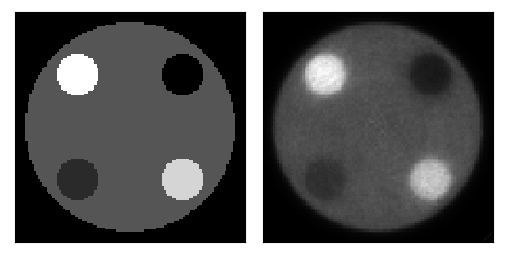

# Simulation and reconstruction demonstration

This demo will show how to:
- Create a scanner with a regular geometry
- Define a dynamic phantom (ground truth) with both motion and kinetics
- Perform a forward projection and add Poisson noise ("simulation")
- Transform the histogram into a list-mode
- Reconstruct the list-mode

This demonstration is entirely done in 2D to keep it simple.
We will not incorporate factors such as attenuation, normalisation or scatter/randoms.

## Imports

We will need to import YRT-PET's Python interface and NumPy.

```python
import pyyrtpet as yrt
import numpy as np
import tqdm # For visualization only
```

## Scanner definition

Let's start by defining a scanner. We will define a small cylindrical 2D scanner.

```python
scanner = yrt.Scanner("My2DScanner",
                      axial_fov=5,
                      crystal_size_z=5,
                      crystal_size_trans=5,
                      crystal_depth=10,
                      scanner_radius=250,
                      dets_per_ring=300,
                      num_rings=1, # This is a 2D scanner
                      num_doi=2,
                      max_ring_diff=0,
                      min_ang_diff=11,
                      dets_per_block=10)
```

## Defining image space

Let's define an image grid with 2 mm voxels

```python
nx = 150
ny = 150
nz = 1 # This is a 2D image
vx = 2 # mm
vy = 2 # mm
vz = 2 # mm
img_params = yrt.ImageParams(nx, ny, nz, vx*nx, vy*ny, vz*nz)
```

## Generating the simulated phantom

For our demonstration, we will synthetically generate a phantom with circles defining each region.

For this we will need this helper function:
```python
def get_circle_image(img_params : yrt.ImageParams, center, radius: float):
    """
    Draws a filled circle in a 2D grid and return the grid.

    Arguments:
        img_params: Image parameters object (yrt.ImageParams object)
        center: Physical center in mm (Tuple (x_p, y_p))
        radius: Radius of the circle in mm (float)

    Returns:
        2D numpy array (ny, nx) with 1 inside the circle, 0 outside
    """
    nx, ny = img_params.nx, img_params.ny
    vx, vy = img_params.vx, img_params.vy # mm
    ox, oy = img_params.off_x, img_params.off_y # mm
    cx_p, cy_p = center # In physical coordinates (mm)

    cx = (cx_p - ox) / vx + (nx - 1) / 2
    cy = (cy_p - oy) / vy + (ny - 1) / 2

    y_idx, x_idx = np.ogrid[:ny, :nx]
    dist_squared = ((y_idx - cy) * vy) ** 2 + ((x_idx - cx) * vx) ** 2

    grid = (dist_squared <= radius ** 2).astype(np.float32)
    return grid
```

### Static phantom

Let us define a phantom that consits of a large circle (representing soft tissue) and
four circles each representing a small region.

```python
soft_tissue = get_circle_image(img_params, (0, 0), 100)
top_left_region = get_circle_image(img_params, (-50, 50), 20)
top_right_region = get_circle_image(img_params, (50, 50), 20)
bottom_left_region = get_circle_image(img_params, (-50, -50), 20)
bottom_right_region = get_circle_image(img_params, (50, -50), 20)
```

### Defining kinetics (Dynamic frames)

Now let us define a dynamic framing for a hypothetical 5 minute-scan.
The intensity of each region will vary throughout the dynamic frames.

#### Dynamic framing

We will define a set of frames of varying length.
```python
scan_duration_ms = 5 * 60 * 1000

# Seven frames. The framing starts at 0 ms
# Here we define how the dynamic framing looks w.r.t. the duration fo each frame
num_dynamic_frames = 7
dynamic_framing_lengths = [15  * 1000, # 15 s
                           15  * 1000, # 15 s
                           30  * 1000, # 30 s
                           30  * 1000, # 30 s
                           30  * 1000, # 30 s
                           120 * 1000, # 2 min
                           60  * 1000] # 1 min (Totalling 5 min)
assert len(dynamic_framing_lengths) == num_dynamic_frames

# Then we write the dynamic framing as a list of timestamps defining the start of each frame
#  (plus one other timestamp defining the end of the last frame)
dynamic_framing_np = np.zeros(shape=(num_dynamic_frames + 1), dtype=np.uint32)
curr_timestamp = 0 # Start at 0 ms
dynamic_framing_np[0] = curr_timestamp
for frame_i, l in enumerate(dynamic_framing_lengths):
    curr_timestamp += l
    dynamic_framing_np[frame_i + 1] = curr_timestamp
assert dynamic_framing_np[num_dynamic_frames] == scan_duration_ms

# Create the dynamic framing as a YRT-PET object
dynamic_framing = yrt.DynamicFraming(dynamic_framing_np)
assert dynamic_framing.isValid()
```

#### Dynamic phantom

Let us write the phantom with varying kinetics over the dynamic framing set earlier. We will not attempt to mimic biologically-realistic kinetics here as this is not within the scope of this Python interface demo.

```python
dynamic_phantom = np.zeros(shape=(num_dynamic_frames, nz, ny, nx), dtype=np.float32)

# Values at each reagion over time (Without correcting for the frame duration)
scale_soft_tissue = np.array([0.05, 0.1, 0.2, 0.3, 0.3, 0.1, 0.05])
scale_top_left_region = scale_soft_tissue * (-0.5)
scale_top_right_region = np.array([0.1, 0.2, 0.3, 0.4, 0.2, 0.1, 0])
scale_bottom_left_region = np.array([0.05, 0.2, 0.4, 0.3, 0.2, 0, -0.05])
scale_bottom_right_region = scale_soft_tissue * -1 # Zeros (Cancels soft tissue activity)

for frame_i in range(num_dynamic_frames):
    frame_phantom = soft_tissue * scale_soft_tissue[frame_i] + \
                    top_left_region * scale_top_left_region[frame_i] + \
                    top_right_region * scale_top_right_region[frame_i] + \
                    bottom_left_region * scale_bottom_left_region[frame_i] + \
                    bottom_right_region * scale_bottom_right_region[frame_i]

    # Populate the 4D ground truth
    dynamic_phantom[frame_i, 0] = frame_phantom
```

### Defining movement (Motion frames)

Now let us define the movement of the phantom.
The motion frames will be 1 second long and will each encode a random translation and a rotation.

```python
frame_duration_ms = 1000
num_motion_frames = scan_duration_ms // frame_duration_ms
lor_motion = yrt.LORMotion(num_motion_frames)

# Randomly generate the rotations and translations
rng = np.random.default_rng()

# Only define rotation around the Z axis. Varying from 0 to pi/8 degrees
rotations = rng.random(size=(num_motion_frames), dtype=np.float32) * np.pi / 8
# Translation in X and Y. Varying it from -10 mm to 10mm
translations = rng.random(size=(num_motion_frames, 2)) * 20 - 10

# Populate the LORMotion object
curr_timestamp = 0 # Start at 0 ms
for frame_i in range(num_motion_frames):
    # Set timestamp for this frame
    lor_motion.setStartingTimestamp(frame_i, curr_timestamp)

    # Compute transformation for this frame
    rotation = yrt.Vector3D(0, 0, rotations[frame_i])
    translation = yrt.Vector3D(translations[frame_i, 0],
                               translations[frame_i, 1],
                               0)
    transform = yrt.fromRotationAndTranslationVectors(rotation, translation)

    # Set transformation for this frame
    lor_motion.setTransform(frame_i, transform)
    curr_timestamp += frame_duration_ms
```

### Merging motion and kinetics to generate final phantom

We will then generate a 4-dimensional image that will track this phantom over time.
This essentially means to generate an image for each one of the *smallest* unit of
time at which the phantom varies.
Since the motion frames are 1 s each, we will create an image each frame (4th dimension)
being associated to a motion frame.
All of this while keeping track of the dynamic framing coming from the kinetics computed above.

This will give us the final image (with both motion and kinetics) that will be used
for the simulation.

```python
full_phantom = np.zeros(shape=(num_motion_frames, nz, ny, nx), dtype=np.float32)

curr_dynamic_frame = 0
transformed_phantom = yrt.ImageOwned(img_params)
transformed_phantom.allocate() # Necessary
transformed_phantom_np = np.array(transformed_phantom, copy=False)

for motion_frame_i in range(num_motion_frames):
    timestamp = lor_motion.getStartingTimestamp(motion_frame_i)
    transform = lor_motion.getTransform(motion_frame_i)

    # Find the dynamic frame associated to this motion frame
    while curr_dynamic_frame < num_dynamic_frames:
        if dynamic_framing.getStartingTimestamp(curr_dynamic_frame) <= timestamp and \
           dynamic_framing.getStoppingTimestamp(curr_dynamic_frame) > timestamp:
           break
        curr_dynamic_frame += 1 


    transform_t = transform.getInverse()
    transformed_phantom_np[:] = dynamic_phantom[curr_dynamic_frame]
    transformed_phantom = transformed_phantom.transformImage(transform_t)

    # Re-init the NumPy array since the image was re-allocated
    transformed_phantom_np = np.array(transformed_phantom, copy=False)

    full_phantom[motion_frame_i] = transformed_phantom_np
```

## Simulating the phantom

As a simulation, we will generate a list-mode from the forward projection (in histogram)

### Forward projection

Let us create a `Histogram3D` object for every motion frame and forward project the associated image from the dynamic `full_phantom` computed above. We will use the Siddon projector.

```python
# Start with one histogram
forw_his = yrt.Histogram3DOwned(scanner)
forw_his.allocate()
bin_iter = forw_his.getBinIter(num_subsets=1, idx_subset=0)

# Initialize projector
proj_params = yrt.ProjectorParams(scanner)
proj_params.setProjector("S") # Siddon
proj_oper = yrt.createOperatorProjector(proj_params, bin_iter)

# Prepare the histograms
forw_his_list = list()
for frame_i in tqdm.trange(num_motion_frames):
    # Prepare histogram for projection
    frame_forw_his = yrt.Histogram3DOwned(scanner)
    frame_forw_his.allocate()

    # Gather image to forward project
    frame_image_np = full_phantom[frame_i]
    frame_image = yrt.ImageAlias(img_params)
    frame_image.bind(frame_image_np)

    # Forward project
    proj_oper.applyA(frame_image, frame_forw_his)

    # Add to list
    forw_his_list.append(frame_forw_his)
```

### Adding Poisson noise to the histograms

In order to make the simulation more realistic, we will add Poisson
noise to the histograms. The noise is amplified if the histograms
are downscaled, which simulates a lower count (or lower dose).
In this demo, we use `0.1`.
Since these histograms will later be converted into a list-mode, a
higher count will require more memory.
If you are working under low memory constraints, you can use a lower
factor to simulate an even lower count.

```python
histo_scaling = 0.1  # Adjust this if working with low memory.
for frame_i in range(num_motion_frames):
    frame_forw_his = forw_his_list[frame_i]
    frame_forw_his_np = np.array(frame_forw_his, copy=False)
    frame_forw_his_np[:] = rng.poisson(frame_forw_his_np * histo_scaling)
```

### Turning the histograms into one large list-mode

```python
lm_total = yrt.ListModeLUTAlias(scanner)
lm_ts = list()
lm_d1 = list()
lm_d2 = list()

for frame_i in tqdm.trange(num_motion_frames):
    lm = yrt.ListModeLUTOwned(scanner)
    
    frame_forw_his = forw_his_list[frame_i]
    yrt.histogram3DToListModeLUT(frame_forw_his, lm, 0)

    lm_ts_frame = np.array([lor_motion.getStartingTimestamp(frame_i)] * \
                            lm.count()).astype(np.uint32)
    lm_d1_frame = lm.getDetector1Array()
    lm_d2_frame = lm.getDetector2Array()

    lm_ts.append(lm_ts_frame)
    lm_d1.append(lm_d1_frame)
    lm_d2.append(lm_d2_frame)

lm_ts = np.concatenate(lm_ts)
lm_d1 = np.concatenate(lm_d1)
lm_d2 = np.concatenate(lm_d2)
lm_total.bind(lm_ts, lm_d1, lm_d2)

# Assign the motion information to the list-mode
lm_total.addLORMotion(lor_motion)

# Assign the dynamic framing to the list-mode
lm_total.addDynamicFraming(dynamic_framing)
```

## Reconstructing the list-mode

Now we have a list-mode with both motion information and dynamic framing,
which came from a simulation of several regions with varying kinetics.

Now let us reconstruct it (with motion correction).

First, we need to define the inputs to our OSEM reconstruction:
```python
# Prepare the image parameters to use for the dynamic reconstruction:
img_params_dyn = yrt.ImageParams(img_params)
img_params_dyn.nt = num_dynamic_frames

# OSEM object
osem = yrt.createOSEM(scanner, use_gpu=False)
osem.setDataInput(lm_total)
osem.setImageParams(img_params_dyn)
osem.setProjector("S")
osem.setNumRays(4) # 4-rays Siddon

osem.num_MLEM_iterations = 10 # iterations
osem.num_OSEM_subsets = 1 # subsets (We keep it simple at one here)

# Let's add a PSF of 3mm x 3mm x 3mm FWHM
osem.addUniformGaussianImagePSFFromFWHM(3,3,3)

# We do not need to mention motion correction or dynamic framing here as those
#  were embedded in the list-mode object

```


### Sensitivity image generation

The first step is to generate the sensitivity image.
This is the sensitivity image without any motion.
Notice that the function `generateSensitivityImages` is in plural.
This is because there can be multiple sensitivity images
(in case of a histogram-based reconstruction with multiple subsets).
The method will therefore return a list with one image.

```python
sens_images = osem.generateSensitivityImages()
assert len(sens_images) == 1
sens_image = sens_images[0]
```

### Time-averaging of the sensitivity image

Since we need to perform the reconstruction with motion correction, we must perform
a time-averaging of the sensitivity image by moving the sensitivity image for every motion frame
and summing it with a weight relative to the duration of each motion frame.

Moreover, we need to do this process for every dynamic frame since each dynamic frame
has a different set of motion frames.

```python
sens_image_moved = yrt.timeAverageMoveImageDynamic(lor_motion, sens_image, dynamic_framing)
```

Because of the moving of the sensitivity image, it might lead some of the voxels in
the moved sensitivity image to have a non-null value while the non-moved sensitivity image
had a null value.
This leads to severe artifacts caused by numerical instability.
One way to remedy this is to mask the moved sensitivity image using the non-moved
sensitivity image.

```python
# This method will make all voxels that are zeros in `sens_image` to be
#  multiplied by zero in `sens_image_moved`. We also need to "broadcast" because
#  `sens_image` is in 3D but `sens_image_moved` is in 4D.
sens_image_moved.applyThresholdBroadcast(sens_image, 0, 0, 0, 1, 0)
```

### The actual reconstruction

First, specify to the OSEM object the sensitivity image you want to use:
```python
osem.setSensitivityImage(sens_image_moved)
```

Then, launch the reconstruction

```python
recon_image = osem.reconstruct()
```

You can interpret the reconstructed image as a numpy array:
```python
recon_image_np = np.array(recon_image)
```

Then, to visualize the result, you can do:

```python
import matplotlib.pyplot as plt

fig, axes = plt.subplots(ncols=2, figsize=(6.4, 3.2))
frame_to_show = 2

axes[0].matshow(dynamic_phantom[frame_to_show, 0, 20:130, 20:130], cmap='gray')
axes[1].matshow(recon_image_np[frame_to_show, 0, 20:130, 20:130], cmap='gray')
for ax in axes:
    ax.xaxis.set_visible(False)
    ax.yaxis.set_visible(False)
fig.tight_layout()
fig.savefig('demo_result.png')
fig.show()
```

Which gives an image like this:



Or you can save the image in the hard drive as a NIfTI file.

```python
recon_image.writeToFile("recon_image.nii.gz")
```
